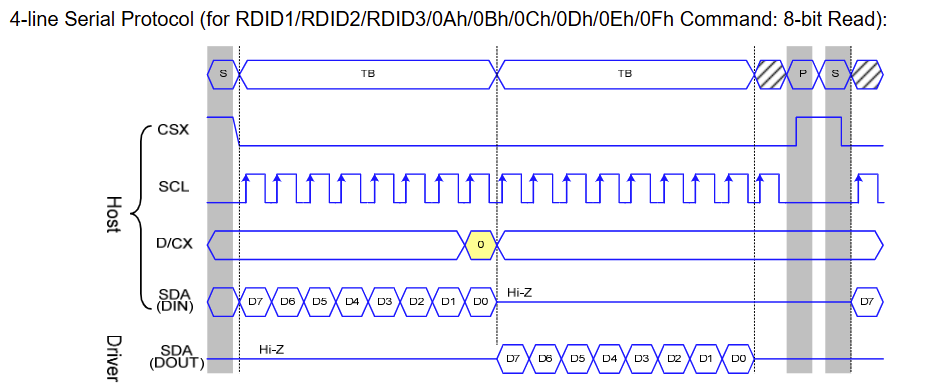
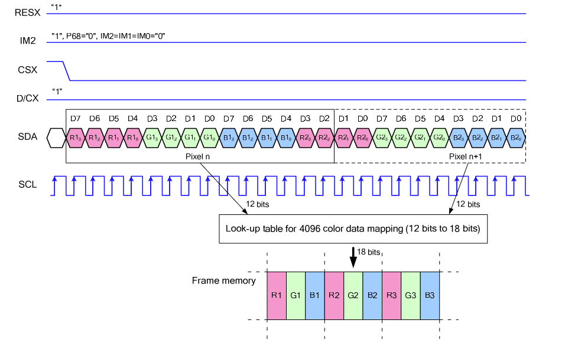
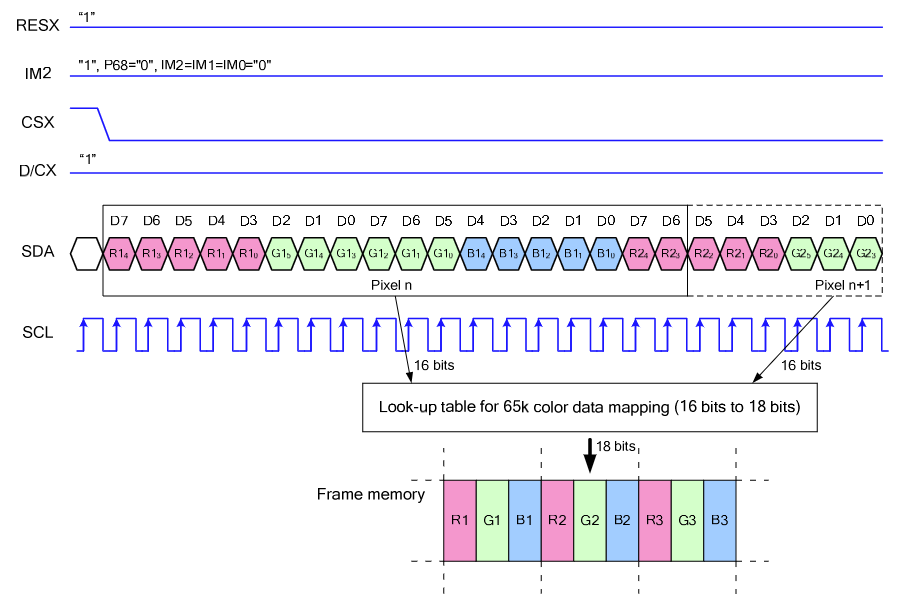
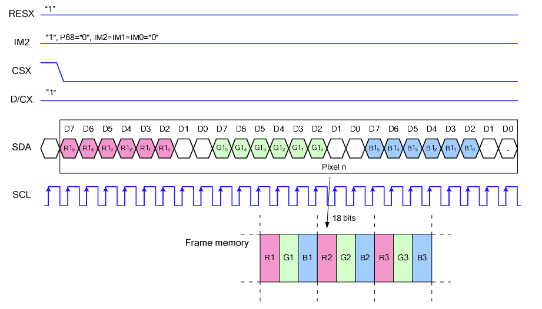
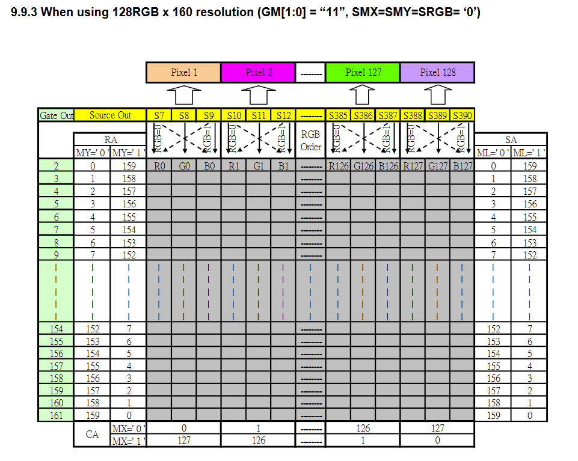

# ST7735S 屏幕驱动芯片

ST7735S是262K[^1]单芯片TFT/LCD控制器。它由396条源极线和162条栅极线驱动电路组成。该芯片可以直接通过SPI总线或者8位/9位/16位/18位并行接口连接到外部单片机，显示像素数据保存在其内部大小为132\*162\*18bits的RAM中。不需要外部操作时钟就可以读写显示数据RAM，并且由于集成了液晶供能电路，系统组件数量更少。

这里只介绍常见的TFT显示屏使用方法，也即已经配置为4线串行接口的TFT显示屏。数据手册使用SCL与SDA来称呼4线串行接口相关引脚，SCL与SDA与I2C的含义相同。此串行接口有点像是SPI与I2C的结合体，不是标准协议，所以大多数ST7735S示例程序都是软件模拟协议。另一方面，该协议传输方式类似SPI，相对简单，总线只是在时钟上升沿传输数据，不像IIC那样复杂，软件模拟起来更容易。

## 引脚定义

| 引脚名称 | 含义                           |
| -------- | ------------------------------ |
| GND      | 电源地                         |
| VCC      | 3.3V-5V直流电                  |
| SCL      | SPI时钟线                      |
| SDA      | SPI数据线                      |
| RES      | 重启                           |
| DC       | SPI数据/命令选择               |
| CS       | 片选信号                       |
| BLK      | 背光控制，默认浮动，低电平关闭 |

## 写命令模式

写模式表示MCU向ST7735S芯片写命令或者数据。3线串口需要一个比特表示当前是命令还是数据，而4线串口使用DC来判定是数据还是命令，数据直接传输无需额外控制比特。如果DC为高电平，那么传输的字节被视为数据或者命令的参数，分别写入其RAM中或者命令参数寄存器中。

CS 高电平时SCL信号被忽略，SCL上升沿时采样SDA。4线串行接口中，DC表示当前字节是命令（DC低电平）还是RAM数据/命令参数（DC高电平）。DC在SCL第八个上升沿被采样，另外，如果CS在最后一个比特传输完成后仍然保持低电平，那么芯片准备在下一个SCL上升沿接收下一个字节的MSB。

## 读取功能

从芯片中读取寄存器值。MCU需要向芯片发送读取ID或者寄存器命令，然后芯片通过SDA把值传输到MCU（没错，SDA是双向的，这点类似I2C）。之后，在下一个命令发送前，CS需要拉高。芯片在SCL的下降沿输出比特，因此MCU能够在上升沿读到数据。

在命令字节的最后一个比特传输的时钟的下降沿之前，SDA必须设置为三态，否则芯片无法对外输出。

根据手册，24bits和32bits数据读取时需要在命令传输后有一个dummy时钟，该时钟不进行数据传输。

## 颜色数据传输

4线SPI支持以下颜色：

- 4k Colors, RGB 4-4-4-bit Input
- 65k Colors, RGB 5-6-5-bit Input
- 262k Colors, RGB 6-6-6-bit Input

### RGB444 12bit输入（3AH="03h"[^2]）

像素数据按照如图所示的顺序输入。12bit的像素数据通过内部查找表转换成18bit像素。Rx3是MSB，Rx0是LSB，G、B亦同。

### RGB565 16bit输入（3AH="05h"）

同样使用查找表，MSB先出。

### RGB666 18bit输入（3AH="06h"）

同样使用查找表，MSB先出。

## 内存地址映射

使用MADCTL寄存器控制下面的参数。

MX和MY控制横纵地址顺序。其中，M的含义是“MIRROR”，意为镜像。

ML 控制扫描的方向。

RGB 控制R、G、B的位置。R和B的位置可交换。

## 地址计数器

RAM通过地址进行索引，地址范围X=0\~131，Y=0\~161。不允许超过范围的地址。写入RAM之前必须先定义一个窗口，该窗口通过XS和YS定义开始地址，XE和YE定义结束地址。

例如，如果要写整个窗口，就需要定义XS=YS=0，XE=131，YE=161。

在垂直索引模式（MV=1），每写一个字节Y地址自增1，到达YE后回到YS同时X移到下一列。同理水平索引模式（MV=0）下每写一个字节X地址自增1，到达XE后回到XS同时Y移到下一行。

MX、MY、MV更改后需要重新写数据到RAM。

| 条件             | 列计数器 | 行计数器 |
| ---------------- | -------- | -------- |
| RAMWR/RAMRD 命令 | 回到XS   | 回到YS   |
| 完成像素读写     | 增1      | 不变     |
| 列计数器超过XE   | 回到XS   | 增1      |
| 行计数器超过YE   | 回到XS   | 回到YS   |

MADCTL提供了MX、MY、MV选项。128x60模式（GM[1:0]=2'b11）下，CASET与RASET有以下特性：

| MV   | MX   | MY   | CASET          | RASET          |
| ---- | ---- | ---- | -------------- | -------------- |
| 0    | 0    | 0    | 物理列指针     | 物理行指针     |
| 0    | 0    | 1    | 物理列指针     | 127-物理行指针 |
| 0    | 1    | 0    | 127-物理列指针 | 物理行指针     |
| 0    | 1    | 1    | 127-物理列指针 | 127-物理行指针 |
| 1    | 0    | 0    | 物理列指针     | 物理行指针     |
| 1    | 0    | 1    | 127-物理列指针 | 物理行指针     |
| 1    | 1    | 0    | 物理列指针     | 127-物理行指针 |
| 1    | 1    | 1    | 127-物理列指针 | 127-物理行指针 |

注：无论MX、MY、MV如何，数据写入顺序总是不变，按照R-G-B的MSB先出的顺序。

## 系统功能命令列表

### NOP

<table>
	<tr>
		<th>00H</th>
		<th colspan="3">NOP (No Operation，无操作)</th>
	</tr>
	<tr>
		<td>Inst / Para</td>
		<td>DC</td>
		<td>D17-8</td>
		<td>D7-0</td>
	</tr>
    <tr>
    	<td>NOP</td>
        <td>0</td>
        <td>-</td>
        <td>00H</td>
    </tr>
    <tr>
    	<td>Parameter</td>
        <td colspan="3">No Parameter</td>
    </tr>
    <tr>
    	<td>Description</td>
        <td colspan="3">This command is empty command.</td>
    </tr>
</table>

### SWRESET（01H，软重置）

<table>
	<tr>
		<th>01H</th>
		<th colspan="3">SWRESET (Software Reset，软重置)</th>
	</tr>
	<tr>
		<td>Inst / Para</td>
		<td>DC</td>
		<td>D17-8</td>
		<td>D7-0</td>
	</tr>
    <tr>
    	<td>NOP</td>
        <td>0</td>
        <td>-</td>
        <td>01H</td>
    </tr>
    <tr>
    	<td>Parameter</td>
        <td colspan="3">No Parameter</td>
    </tr>
    <tr>
    	<td>Description</td>
        <td colspan="3">如果在Sleep In模式使用软重置，那么需要等待120毫秒才能发送下一个命令。 在这120毫秒内，芯片加载默认值到寄存器。 如果在Sleep Out模式或者Display On模式，同样需要等待120毫秒。</td>
    </tr>
</table>

### SLPIN（10H，Sleep In）

<table>
	<tr>
		<th>10H</th>
		<th colspan="3">SLPIN (Sleep In)</th>
	</tr>
	<tr>
		<td>Inst / Para</td>
		<td>DC</td>
		<td>D17-8</td>
		<td>D7-0</td>
	</tr>
    <tr>
    	<td>NOP</td>
        <td>0</td>
        <td>-</td>
        <td>10H</td>
    </tr>
    <tr>
    	<td>Parameter</td>
        <td colspan="3">No Parameter</td>
    </tr>
    <tr>
    	<td>Description</td>
        <td colspan="3">该命令使模块进入最小功耗模式。 该模式下DC/DC转换器、内部振荡器、面板扫描都被停止。</td>
    </tr>
    <tr>
    	<td>Restriction</td>
        <td colspan="3">已经处于Sleep In模式时该命令无影响。Sleep In模式只能通过Sleep Out命令退出。 在Sleep Out模式或者Display On模式，发送该命令后需要等待120毫秒才能发送下一个命令。</td>
    </tr>
    <tr>
    	<td>Default</td>
        <td colspan="3">在上电序列、软重启、硬重启之后，默认都是Sleep In模式。</td>
    </tr>
</table>

### SLPOUT（11H，Sleep Out）

<table>
	<tr>
		<th>11H</th>
		<th colspan="3">SLPOUT  (Sleep Out)</th>
	</tr>
	<tr>
		<td>Inst / Para</td>
		<td>DC</td>
		<td>D17-8</td>
		<td>D7-0</td>
	</tr>
    <tr>
    	<td>NOP</td>
        <td>0</td>
        <td>-</td>
        <td>11H</td>
    </tr>
    <tr>
    	<td>Parameter</td>
        <td colspan="3">No Parameter</td>
    </tr>
    <tr>
    	<td>Description</td>
        <td colspan="3">该命令关闭Sleep In模式。 该模式下DC/DC转换器、内部振荡器、面板扫描都被启动。</td>
    </tr>
    <tr>
    	<td>Restriction</td>
        <td colspan="3">已经处于Sleep Out模式时该命令无影响。Sleep Out模式只能通过Sleep In命令退出。 在Sleep In模式，发送该命令后需要等待120毫秒才能发送下一个命令。 在Sleep Out模式或者Display On模式，发送该命令后需要等待120毫秒才能发送下一个命令，这120毫秒内芯片把寄存器设为默认值并且进行自检。</td>
    </tr>
    <tr>
    	<td>Default</td>
        <td colspan="3">在上电序列、软重启、硬重启之后，默认都是Sleep In模式。</td>
    </tr>
</table>

### PTLON（12H，Partial模式开启）

<table>
	<tr>
		<th>12H</th>
		<th colspan="3">PTLON (Partial Display Mode On，部分显示模式开启)</th>
	</tr>
	<tr>
		<td>Inst / Para</td>
		<td>DC</td>
		<td>D17-8</td>
		<td>D7-0</td>
	</tr>
    <tr>
    	<td>PTLON</td>
        <td>0</td>
        <td>-</td>
        <td>12H</td>
    </tr>
    <tr>
    	<td>Parameter</td>
        <td colspan="3">No Parameter</td>
    </tr>
    <tr>
    	<td>Description</td>
        <td colspan="3">该命令开启Partial（部分显示）模式。 部分显示的窗口通过Partial Area指令设置。</td>
    </tr>
    <tr>
    	<td>Default</td>
        <td colspan="3">在上电序列、软重启、硬重启之后，默认都是Normal Display模式。</td>
    </tr>
</table>

### NORON（13H，Normal模式开启）

<table>
	<tr>
		<th>13H</th>
		<th colspan="3">NORON (Normal Display Mode On，正常显示模式开启)</th>
	</tr>
	<tr>
		<td>Inst / Para</td>
		<td>DC</td>
		<td>D17-8</td>
		<td>D7-0</td>
	</tr>
    <tr>
    	<td>NORON</td>
        <td>0</td>
        <td>-</td>
        <td>13H</td>
    </tr>
    <tr>
    	<td>Parameter</td>
        <td colspan="3">No Parameter</td>
    </tr>
    <tr>
    	<td>Description</td>
        <td colspan="3">该命令使模块回到Normal（正常显示）模式。 也即关闭部分显示模式。 该指令与PTLON相对。</td>
    </tr>
    <tr>
    	<td>Default</td>
        <td colspan="3">在上电序列、软重启、硬重启之后，默认都是Normal Display模式。</td>
    </tr>
</table>
### DISPOFF（28H，显示关闭）

<table>
	<tr>
		<th>28H</th>
		<th colspan="3">DISPOFF (Display Off，显示关闭)</th>
	</tr>
	<tr>
		<td>Inst / Para</td>
		<td>DC</td>
		<td>D17-8</td>
		<td>D7-0</td>
	</tr>
    <tr>
    	<td>DISPOFF</td>
        <td>0</td>
        <td>-</td>
        <td>28H</td>
    </tr>
    <tr>
    	<td>Parameter</td>
        <td colspan="3">No Parameter</td>
    </tr>
    <tr>
    	<td>Description</td>
        <td colspan="3">该命令使模块进入显示关闭模式。 此模式不允许从内存输出数据，只显示空白页面。 该指令不更改内存或者寄存器值。 只能通过Display On命令退出此模式。</td>
    </tr>
    <tr>
    	<td>Default</td>
        <td colspan="3">在上电序列、软重启、硬重启之后，默认都是Display Off模式。</td>
    </tr>
</table>

### DISPON（29H，显示开启）

<table>
	<tr>
		<th>29H</th>
		<th colspan="3">DISPOFF (Display On，显示开启)</th>
	</tr>
	<tr>
		<td>Inst / Para</td>
		<td>DC</td>
		<td>D17-8</td>
		<td>D7-0</td>
	</tr>
    <tr>
    	<td>DISPON</td>
        <td>0</td>
        <td>-</td>
        <td>29H</td>
    </tr>
    <tr>
    	<td>Parameter</td>
        <td colspan="3">No Parameter</td>
    </tr>
    <tr>
    	<td>Description</td>
        <td colspan="3">该命令使模块退出显示关闭模式。 此模式允许从内存输出数据。 该指令不更改内存或者寄存器值。</td>
    </tr>
    <tr>
    	<td>Default</td>
        <td colspan="3">在上电序列、软重启、硬重启之后，默认都是Display Off模式。</td>
    </tr>
</table>

### CASET（2AH，设置列地址）

<table>
	<tr>
		<th>2AH</th>
		<th colspan="10">CASET (Column Address Set，设置列地址)</th>
	</tr>
	<tr>
		<td>Inst / Para</td>
		<td>DC</td>
		<td>D17-8</td>
		<td>D7</td>
        <td>D6</td>
        <td>D5</td>
        <td>D4</td>
        <td>D3</td>
        <td>D2</td>
        <td>D1</td>
        <td>D0</td>
	</tr>
    <tr>
    	<td>CASET</td>
        <td>0</td>
        <td>-</td>
        <td colspan="8">2AH</td>
    </tr>
    <tr>
    	<td>1st Parameter</td>
        <td>1</td>
        <td>-</td>
        <td colspan="8">XS[15:8]</td>
    </tr>
    <tr>
    	<td>2nd Parameter</td>
        <td>1</td>
        <td>-</td>
        <td colspan="8">XS[7:0]</td>
    </tr>
    <tr>
    	<td>3rd Parameter</td>
        <td>1</td>
        <td>-</td>
        <td colspan="8">XE[15:8]</td>
    </tr>
    <tr>
    	<td>4th Parameter</td>
        <td>1</td>
        <td>-</td>
        <td colspan="8">XE[7:0]</td>
    </tr>
    <tr>
    	<td>Description</td>
        <td colspan="10">RAMWR命令将使用该命令定义的地址XS[7:0]和XE[7:0]。15:8似乎没有用。 XS一定要小于等于XE。若超出范围，数据将被丢弃。</td>:
    </tr>
</table>

### RASET（2BH，设置行地址）

<table>
	<tr>
		<th>2BH</th>
		<th colspan="10">RASET (Row Address Set，设置行地址)</th>
	</tr>
	<tr>
		<td>Inst / Para</td>
		<td>DC</td>
		<td>D17-8</td>
		<td>D7</td>
        <td>D6</td>
        <td>D5</td>
        <td>D4</td>
        <td>D3</td>
        <td>D2</td>
        <td>D1</td>
        <td>D0</td>
	</tr>
    <tr>
    	<td>RASET</td>
        <td>0</td>
        <td>-</td>
        <td colspan="8">2BH</td>
    </tr>
    <tr>
    	<td>1st Parameter</td>
        <td>1</td>
        <td>-</td>
        <td colspan="8">YS[15:8]</td>
    </tr>
    <tr>
    	<td>2nd Parameter</td>
        <td>1</td>
        <td>-</td>
        <td colspan="8">YS[7:0]</td>
    </tr>
    <tr>
    	<td>3rd Parameter</td>
        <td>1</td>
        <td>-</td>
        <td colspan="8">YE[15:8]</td>
    </tr>
    <tr>
    	<td>4th Parameter</td>
        <td>1</td>
        <td>-</td>
        <td colspan="8">YE[7:0]</td>
    </tr>
    <tr>
    	<td>Description</td>
        <td colspan="10">RAMWR命令将使用该命令定义的地址YS[7:0]和YE[7:0]。15:8似乎没有用。 YS一定要小于等于YE。若超出范围，数据将被丢弃。</td>:
    </tr>
</table>

### RAMWR（2CH，写内存）

<table>
	<tr>
		<th>2CH</th>
		<th colspan="10">RAMWR (Memory Write，写内存)</th>
	</tr>
	<tr>
		<td>Inst / Para</td>
		<td>DC</td>
		<td>D17-8</td>
		<td>D7</td>
        <td>D6</td>
        <td>D5</td>
        <td>D4</td>
        <td>D3</td>
        <td>D2</td>
        <td>D1</td>
        <td>D0</td>
	</tr>
    <tr>
    	<td>RASET</td>
        <td>0</td>
        <td>-</td>
        <td colspan="8">2CH</td>
    </tr>
    <tr>
    	<td>1st Parameter</td>
        <td>1</td>
        <td>D[17:8]</td>
        <td colspan="8">D[7:0]</td>
    </tr>
    <tr>
    	<td>|</td>
        <td>1</td>
        <td>|</td>
        <td colspan="8">|</td>
    </tr>
    <tr>
    	<td>Nth Parameter</td>
        <td>1</td>
        <td>D[17:8]</td>
        <td colspan="8">D[7:0]</td>
    </tr>
    <tr>
    	<td>Description</td>
        <td colspan="10">不限制参数长度。在128*160模式下，只有128*160*18bits的内存可供写入。</td>
    </tr>
</table>

### MADCTL（36H，内存数据访问控制）

该指令可用于控制显示方向。

<table>
	<tr>
		<th>36H</th>
		<th colspan="10">MADCTL (Memory Data Access Control，内存数据访问控制)</th>
	</tr>
	<tr>
		<td>Inst / Para</td>
		<td>DC</td>
		<td>D17-8</td>
		<td>D7</td>
        <td>D6</td>
        <td>D5</td>
        <td>D4</td>
        <td>D3</td>
        <td>D2</td>
        <td>D1</td>
        <td>D0</td>
	</tr>
    <tr>
    	<td>NORON</td>
        <td>0</td>
        <td>-</td>
        <td colspan="8">36H</td>
    </tr>
    <tr>
    	<td>Parameter</td>
        <td>1</td>
        <td>-</td>
        <td>MY</td>
        <td>MX</td>
        <td>MV</td>
        <td>ML</td>
        <td>RGB</td>
        <td>MH</td>
        <td colspan="2">-</td>
    </tr>
    <tr>
    	<td>Description</td>
        <td colspan="10">
            该命令定义读写的扫描方向。其中MY、MX、MV控制MCU向内存的读写顺序。
             
            <li>MY：行地址顺序。</li>
            <li>MX：列地址顺序。</li>
            <li>MV：行列交换。</li>
            <li>ML：垂直刷新顺序。0表示从顶部向底部刷新，1相反。</li>
            <li>RGB：R-G-B或者B-G-R顺序。</li>
            <li>MH：水平刷新顺序。0表示从左到右刷新，1相反。</li>
        </td>
    </tr>
    <tr>
    	<td>Default</td>
        <td colspan="10">在上电序列、硬重启之后，默认都是0。软重启后，都保持不变。</td>
    </tr>
</table>
### COLMOD（3AH，接口像素格式）

<table>
	<tr>
		<th>3AH</th>
		<th colspan="10">COLMOD (Interface Pixel Format，接口像素格式)</th>
	</tr>
	<tr>
		<td>Inst / Para</td>
		<td>DC</td>
		<td>D17-8</td>
		<td>D7</td>
        <td>D6</td>
        <td>D5</td>
        <td>D4</td>
        <td>D3</td>
        <td>D2</td>
        <td>D1</td>
        <td>D0</td>
	</tr>
    <tr>
    	<td>COLMOD</td>
        <td>0</td>
        <td>-</td>
        <td colspan="8">3AH</td>
    </tr>
    <tr>
    	<td>Parameter</td>
        <td>1</td>
        <td>-</td>
        <td colspan="5">-</td>
        <td>IFPF2</td>
        <td>IFPF1</td>
        <td>IFPF0</td>
    </tr>
    <tr>
    	<td>Description</td>
        <td colspan="10">
            该命令定义接口数据格式，即传输像素为RGB444还是565还是666。根据IFPF[2:0]：
             
            <li>011：12bits，RGB444。</li>
            <li>101：16bits，RGB565。</li>
            <li>110：18bits，RGB666。</li>
            <li>111：未定义。</li>
            注意，读取内存时必须使用110，因为内存的读出只能是18bit。12或者16bit数据通过查找表转换为18bit后就不能再恢复回去。
        </td>
    </tr>
    <tr>
    	<td>Default</td>
        <td colspan="10">在上电序列、硬重启之后，默认都是0。软重启后，都保持不变。</td>
    </tr>
</table>

## 面板功能命令列表

### FRMCTR1（B1h，Normal模式帧速率控制）

<table>
	<tr>
		<th>B1H</th>
		<th colspan="10">FRMCTR1 (Frame Rate Control，帧速率控制)</th>
	</tr>
	<tr>
		<td>Inst / Para</td>
		<td>DC</td>
		<td>D17-8</td>
		<td>D7</td>
        <td>D6</td>
        <td>D5</td>
        <td>D4</td>
        <td>D3</td>
        <td>D2</td>
        <td>D1</td>
        <td>D0</td>
	</tr>
    <tr>
    	<td>FRMCTR1</td>
        <td>0</td>
        <td>-</td>
        <td colspan="8">B1H</td>
    </tr>
    <tr>
    	<td>1st Parameter</td>
        <td>1</td>
        <td>-</td>
        <td colspan="4">-</td>
        <td>RTNA3</td>
        <td>RTNA2</td>
        <td>RTNA1</td>
        <td>RTNA0</td>
    </tr>
    <tr>
    	<td>2nd Parameter</td>
        <td>1</td>
        <td>-</td>
        <td colspan="2">-</td>
        <td>FPA5</td>
        <td>FPA4</td>
        <td>FPA3</td>
        <td>FPA2</td>
        <td>FPA1</td>
        <td>FPA0</td>
    </tr>
    <tr>
    	<td>3rd Parameter</td>
        <td>1</td>
        <td>-</td>
        <td colspan="2">-</td>
        <td>BPA5</td>
        <td>BPA4</td>
        <td>BPA3</td>
        <td>BPA2</td>
        <td>BPA1</td>
        <td>BPA0</td>
    </tr>
    <tr>
    	<td>Description</td>
        <td colspan="10">设置全彩色Normal模式下的帧速率。 Frame rate = fosc / ((RTNA * 2 + 40) * (LINE + FPA + BPA + 2)) 其中： fosc = 850kHz FPA > 0, BPA > 0</td>
    </tr>
    <tr>
    	<td>Default</td>
        <td colspan="10">GM="11"(128*160分辨率)时，在上电序列、软重启、硬重启之后，默认都是05H/3CH/3CH。</td>
    </tr>
</table>

### FRMCTR2（B2h，IDLE模式帧速率控制）

<table>
	<tr>
		<th>B2H</th>
		<th colspan="10">FRMCTR2 (Frame Rate Control，帧速率控制)</th>
	</tr>
	<tr>
		<td>Inst / Para</td>
		<td>DC</td>
		<td>D17-8</td>
		<td>D7</td>
        <td>D6</td>
        <td>D5</td>
        <td>D4</td>
        <td>D3</td>
        <td>D2</td>
        <td>D1</td>
        <td>D0</td>
	</tr>
    <tr>
    	<td>FRMCTR1</td>
        <td>0</td>
        <td>-</td>
        <td colspan="8">B2H</td>
    </tr>
    <tr>
    	<td>1st Parameter</td>
        <td>1</td>
        <td>-</td>
        <td colspan="4">-</td>
        <td>RTNB3</td>
        <td>RTNB2</td>
        <td>RTNB1</td>
        <td>RTNB0</td>
    </tr>
    <tr>
    	<td>2nd Parameter</td>
        <td>1</td>
        <td>-</td>
        <td colspan="2">-</td>
        <td>FPB5</td>
        <td>FPB4</td>
        <td>FPB3</td>
        <td>FPB2</td>
        <td>FPB1</td>
        <td>FPB0</td>
    </tr>
    <tr>
    	<td>3rd Parameter</td>
        <td>1</td>
        <td>-</td>
        <td colspan="2">-</td>
        <td>BPB5</td>
        <td>BPB4</td>
        <td>BPB3</td>
        <td>BPB2</td>
        <td>BPB1</td>
        <td>BPB0</td>
    </tr>
    <tr>
    	<td>Description</td>
        <td colspan="10">设置IDLE模式下的帧速率。 Frame rate = fosc / ((RTNB * 2 + 40) * (LINE + FPB + BPB + 2)) 其中： fosc = 850kHz FPB > 0, BPB > 0</td>
    </tr>
    <tr>
    	<td>Default</td>
        <td colspan="10">GM="11"(128*160分辨率)时，在上电序列、软重启、硬重启之后，默认都是05H/3CH/3CH。</td>
    </tr>
</table>

### FRMCTR3（B3h，Partial模式帧速率控制）

<table>
	<tr>
		<th>B3H</th>
		<th colspan="10">FRMCTR3 (Frame Rate Control，帧速率控制)</th>
	</tr>
	<tr>
		<td>Inst / Para</td>
		<td>DC</td>
		<td>D17-8</td>
		<td>D7</td>
        <td>D6</td>
        <td>D5</td>
        <td>D4</td>
        <td>D3</td>
        <td>D2</td>
        <td>D1</td>
        <td>D0</td>
	</tr>
    <tr>
    	<td>FRMCTR1</td>
        <td>0</td>
        <td>-</td>
        <td colspan="8">B3H</td>
    </tr>
    <tr>
    	<td>1st Parameter</td>
        <td>1</td>
        <td>-</td>
        <td colspan="4">-</td>
        <td>RTNC3</td>
        <td>RTNC2</td>
        <td>RTNC1</td>
        <td>RTNC0</td>
    </tr>
    <tr>
    	<td>2nd Parameter</td>
        <td>1</td>
        <td>-</td>
        <td colspan="2">-</td>
        <td>FPC5</td>
        <td>FPC4</td>
        <td>FPC3</td>
        <td>FPC2</td>
        <td>FPC1</td>
        <td>FPC0</td>
    </tr>
    <tr>
    	<td>3rd Parameter</td>
        <td>1</td>
        <td>-</td>
        <td colspan="2">-</td>
        <td>BPC5</td>
        <td>BPC4</td>
        <td>BPC3</td>
        <td>BPC2</td>
        <td>BPC1</td>
        <td>BPC0</td>
    </tr>
    <tr>
    	<td>4th Parameter</td>
        <td>1</td>
        <td>-</td>
        <td colspan="4">-</td>
        <td>RTND3</td>
        <td>RTND2</td>
        <td>RTND1</td>
        <td>RTND0</td>
    </tr>
    <tr>
    	<td>5th Parameter</td>
        <td>1</td>
        <td>-</td>
        <td colspan="2">-</td>
        <td>FPD5</td>
        <td>FPD4</td>
        <td>FPD3</td>
        <td>FPD2</td>
        <td>FPD1</td>
        <td>FPD0</td>
    </tr>
    <tr>
    	<td>6th Parameter</td>
        <td>1</td>
        <td>-</td>
        <td colspan="2">-</td>
        <td>BPD5</td>
        <td>BPD4</td>
        <td>BPD3</td>
        <td>BPD2</td>
        <td>BPD1</td>
        <td>BPD0</td>
    </tr>
    <tr>
    	<td>Description</td>
        <td colspan="10">设置Partial模式下的帧速率。其中，1st~3rd用于dot inversion模式，4th~6th用于column inversion模式。 Frame rate = fosc / ((RTNC * 2 + 40) * (LINE + FPC + BPC + 2)) 其中： fosc = 850kHz FPC > 0, BPC > 0</td>
    </tr>
    <tr>
    	<td>Default</td>
        <td colspan="10">GM="11"(128*160分辨率)时，在上电序列、软重启、硬重启之后，默认都是05H/3CH/3CH。</td>
    </tr>
</table>

### INVCTR（B4H，显示反转控制）

<table>
	<tr>
		<th>B4H</th>
		<th colspan="10">INVCTR (Display Inversion Control，显示反转控制)</th>
	</tr>
	<tr>
		<td>Inst / Para</td>
		<td>DC</td>
		<td>D17-8</td>
		<td>D7</td>
        <td>D6</td>
        <td>D5</td>
        <td>D4</td>
        <td>D3</td>
        <td>D2</td>
        <td>D1</td>
        <td>D0</td>
	</tr>
    <tr>
    	<td>FRMCTR1</td>
        <td>0</td>
        <td>-</td>
        <td colspan="8">B4H</td>
    </tr>
    <tr>
    	<td>Parameter</td>
        <td>1</td>
        <td>-</td>
        <td colspan="5">-</td>
        <td>NLA</td>
        <td>NLB</td>
        <td>NLC</td>
    </tr>
    <tr>
    	<td>Description</td>
        <td colspan="10">显示反转模式控制，NLA、NLB、MLC分别控制Normal模式、IDLE模式与Partial模式下的显示反转模式，为0表示dot inversion，为1表示column inversion。</td>
    </tr>
    <tr>
    	<td>Default</td>
        <td colspan="10">在上电序列、软重启、硬重启之后，默认都是07H。</td>
    </tr>
</table>

### GMCTRP1（E0H，Gamma（正极）校正特性设置）

<table>
	<tr>
		<th>E0H</th>
		<th colspan="10">GMCTRP1 (Gamma (‘+’polarity) Correction Characteristics Setting，Gamma（正极）校正特性设置)</th>
	</tr>
	<tr>
		<td>Inst / Para</td>
		<td>DC</td>
		<td>D17-8</td>
		<td>D7</td>
        <td>D6</td>
        <td>D5</td>
        <td>D4</td>
        <td>D3</td>
        <td>D2</td>
        <td>D1</td>
        <td>D0</td>
	</tr>
    <tr>
    	<td>FRMCTR2</td>
        <td>0</td>
        <td>-</td>
        <td colspan="8">E0H</td>
    </tr>
    <tr>
    	<td>1st Parameter</td>
        <td>1</td>
        <td>-</td>
        <td colspan="2">-</td>
        <td>VRF0P[5]</td>
        <td>VRF0P[4]</td>
        <td>VRF0P[3]</td>
        <td>VRF0P[2]</td>
        <td>VRF0P[1]</td>
        <td>VRF0P[0]</td>
    </tr>
    <tr>
    	<td>2nd Parameter</td>
        <td>1</td>
        <td>-</td>
        <td colspan="2">-</td>
        <td>VOS0P[5]</td>
        <td>VOS0P[4]</td>
        <td>VOS0P[3]</td>
        <td>VOS0P[2]</td>
        <td>VOS0P[1]</td>
        <td>VOS0P[0]</td>
    </tr>
    <tr>
    	<td>3rd Parameter</td>
        <td>1</td>
        <td>-</td>
        <td colspan="2">-</td>
        <td>PK0P[5]</td>
        <td>PK0P[4]</td>
        <td>PK0P[3]</td>
        <td>PK0P[2]</td>
        <td>PK0P[1]</td>
        <td>PK0P[0]</td>
    </tr>
    <tr>
    	<td>4th Parameter</td>
        <td>1</td>
        <td>-</td>
        <td colspan="2">-</td>
        <td>PK1P[5]</td>
        <td>PK1P[4]</td>
        <td>PK1P[3]</td>
        <td>PK1P[2]</td>
        <td>PK1P[1]</td>
        <td>PK1P[0]</td>
    </tr>
    <tr>
    	<td>5th Parameter</td>
        <td>1</td>
        <td>-</td>
        <td colspan="2">-</td>
        <td>PK2P[5]</td>
        <td>PK2P[4]</td>
        <td>PK2P[3]</td>
        <td>PK2P[2]</td>
        <td>PK2P[1]</td>
        <td>PK2P[0]</td>
    </tr>
    <tr>
    	<td>6th Parameter</td>
        <td>1</td>
        <td>-</td>
        <td colspan="2">-</td>
        <td>PK3P[5]</td>
        <td>PK3P[4]</td>
        <td>PK3P[3]</td>
        <td>PK3P[2]</td>
        <td>PK3P[1]</td>
        <td>PK3P[0]</td>
    </tr>
    <tr>
    	<td>7th Parameter</td>
        <td>1</td>
        <td>-</td>
        <td colspan="2">-</td>
        <td>PK4P[5]</td>
        <td>PK4P[4]</td>
        <td>PK4P[3]</td>
        <td>PK4P[2]</td>
        <td>PK4P[1]</td>
        <td>PK4P[0]</td>
    </tr>
    <tr>
    	<td>8th Parameter</td>
        <td>1</td>
        <td>-</td>
        <td colspan="2">-</td>
        <td>PK5P[5]</td>
        <td>PK5P[4]</td>
        <td>PK5P[3]</td>
        <td>PK5P[2]</td>
        <td>PK5P[1]</td>
        <td>PK5P[0]</td>
    </tr>
    <tr>
    	<td>9th Parameter</td>
        <td>1</td>
        <td>-</td>
        <td colspan="2">-</td>
        <td>PK6P[5]</td>
        <td>PK6P[4]</td>
        <td>PK6P[3]</td>
        <td>PK6P[2]</td>
        <td>PK6P[1]</td>
        <td>PK6P[0]</td>
    </tr>
    <tr>
    	<td>10th Parameter</td>
        <td>1</td>
        <td>-</td>
        <td colspan="2">-</td>
        <td>PK7P[5]</td>
        <td>PK7P[4]</td>
        <td>PK7P[3]</td>
        <td>PK7P[2]</td>
        <td>PK7P[1]</td>
        <td>PK7P[0]</td>
    </tr>
    <tr>
    	<td>11th Parameter</td>
        <td>1</td>
        <td>-</td>
        <td colspan="2">-</td>
        <td>PK8P[5]</td>
        <td>PK8P[4]</td>
        <td>PK8P[3]</td>
        <td>PK8P[2]</td>
        <td>PK8P[1]</td>
        <td>PK8P[0]</td>
    </tr>
    <tr>
    	<td>12th Parameter</td>
        <td>1</td>
        <td>-</td>
        <td colspan="2">-</td>
        <td>PK9P[5]</td>
        <td>PK9P[4]</td>
        <td>PK9P[3]</td>
        <td>PK9P[2]</td>
        <td>PK9P[1]</td>
        <td>PK9P[0]</td>
    </tr>
    <tr>
    	<td>13th Parameter</td>
        <td>1</td>
        <td>-</td>
        <td colspan="2">-</td>
        <td>SELV0P[5]</td>
        <td>SELV0P[4]</td>
        <td>SELV0P[3]</td>
        <td>SELV0P[2]</td>
        <td>SELV0P[1]</td>
        <td>SELV0P[0]</td>
    </tr>
    <tr>
    	<td>13th Parameter</td>
        <td>1</td>
        <td>-</td>
        <td colspan="2">-</td>
        <td>SELV1P[5]</td>
        <td>SELV1P[4]</td>
        <td>SELV1P[3]</td>
        <td>SELV1P[2]</td>
        <td>SELV1P[1]</td>
        <td>SELV1P[0]</td>
    </tr>
    <tr>
    	<td>13th Parameter</td>
        <td>1</td>
        <td>-</td>
        <td colspan="2">-</td>
        <td>SELV62P[5]</td>
        <td>SELV62P[4]</td>
        <td>SELV62P[3]</td>
        <td>SELV62P[2]</td>
        <td>SELV62P[1]</td>
        <td>SELV62P[0]</td>
    </tr>
    <tr>
    	<td>Description</td>
        <td colspan="10">详见手册。</td>
    </tr>
</table>

### GMCTRN1（E1H，Gamma（负极）校正特性设置）

<table>
	<tr>
		<th>E0H</th>
		<th colspan="10">GMCTRP1 (Gamma (‘-’polarity) Correction Characteristics Setting，Gamma（负极）校正特性设置)</th>
	</tr>
	<tr>
		<td>Inst / Para</td>
		<td>DC</td>
		<td>D17-8</td>
		<td>D7</td>
        <td>D6</td>
        <td>D5</td>
        <td>D4</td>
        <td>D3</td>
        <td>D2</td>
        <td>D1</td>
        <td>D0</td>
	</tr>
    <tr>
    	<td>FRMCTR2</td>
        <td>0</td>
        <td>-</td>
        <td colspan="8">E0H</td>
    </tr>
    <tr>
    	<td>1st Parameter</td>
        <td>1</td>
        <td>-</td>
        <td colspan="2">-</td>
        <td>VRF0N[5]</td>
        <td>VRF0N[4]</td>
        <td>VRF0N[3]</td>
        <td>VRF0N[2]</td>
        <td>VRF0N[1]</td>
        <td>VRF0N[0]</td>
    </tr>
    <tr>
    	<td>2nd Parameter</td>
        <td>1</td>
        <td>-</td>
        <td colspan="2">-</td>
        <td>VOS0N[5]</td>
        <td>VOS0N[4]</td>
        <td>VOS0N[3]</td>
        <td>VOS0N[2]</td>
        <td>VOS0N[1]</td>
        <td>VOS0N[0]</td>
    </tr>
    <tr>
    	<td>3rd Parameter</td>
        <td>1</td>
        <td>-</td>
        <td colspan="2">-</td>
        <td>PK0N[5]</td>
        <td>PK0N[4]</td>
        <td>PK0N[3]</td>
        <td>PK0N[2]</td>
        <td>PK0N[1]</td>
        <td>PK0N[0]</td>
    </tr>
    <tr>
    	<td>4th Parameter</td>
        <td>1</td>
        <td>-</td>
        <td colspan="2">-</td>
        <td>PK1N[5]</td>
        <td>PK1N[4]</td>
        <td>PK1N[3]</td>
        <td>PK1N[2]</td>
        <td>PK1N[1]</td>
        <td>PK1N[0]</td>
    </tr>
    <tr>
    	<td>5th Parameter</td>
        <td>1</td>
        <td>-</td>
        <td colspan="2">-</td>
        <td>PK2N[5]</td>
        <td>PK2N[4]</td>
        <td>PK2N[3]</td>
        <td>PK2N[2]</td>
        <td>PK2N[1]</td>
        <td>PK2N[0]</td>
    </tr>
    <tr>
    	<td>6th Parameter</td>
        <td>1</td>
        <td>-</td>
        <td colspan="2">-</td>
        <td>PK3N[5]</td>
        <td>PK3N[4]</td>
        <td>PK3N[3]</td>
        <td>PK3N[2]</td>
        <td>PK3N[1]</td>
        <td>PK3N[0]</td>
    </tr>
    <tr>
    	<td>7th Parameter</td>
        <td>1</td>
        <td>-</td>
        <td colspan="2">-</td>
        <td>PK4N[5]</td>
        <td>PK4N[4]</td>
        <td>PK4N[3]</td>
        <td>PK4N[2]</td>
        <td>PK4N[1]</td>
        <td>PK4N[0]</td>
    </tr>
    <tr>
    	<td>8th Parameter</td>
        <td>1</td>
        <td>-</td>
        <td colspan="2">-</td>
        <td>PK5N[5]</td>
        <td>PK5N[4]</td>
        <td>PK5N[3]</td>
        <td>PK5N[2]</td>
        <td>PK5N[1]</td>
        <td>PK5N[0]</td>
    </tr>
    <tr>
    	<td>9th Parameter</td>
        <td>1</td>
        <td>-</td>
        <td colspan="2">-</td>
        <td>PK6N[5]</td>
        <td>PK6N[4]</td>
        <td>PK6N[3]</td>
        <td>PK6N[2]</td>
        <td>PK6N[1]</td>
        <td>PK6N[0]</td>
    </tr>
    <tr>
    	<td>10th Parameter</td>
        <td>1</td>
        <td>-</td>
        <td colspan="2">-</td>
        <td>PK7N[5]</td>
        <td>PK7N[4]</td>
        <td>PK7N[3]</td>
        <td>PK7N[2]</td>
        <td>PK7N[1]</td>
        <td>PK7N[0]</td>
    </tr>
    <tr>
    	<td>11th Parameter</td>
        <td>1</td>
        <td>-</td>
        <td colspan="2">-</td>
        <td>PK8N[5]</td>
        <td>PK8N[4]</td>
        <td>PK8N[3]</td>
        <td>PK8N[2]</td>
        <td>PK8N[1]</td>
        <td>PK8N[0]</td>
    </tr>
    <tr>
    	<td>12th Parameter</td>
        <td>1</td>
        <td>-</td>
        <td colspan="2">-</td>
        <td>PK9N[5]</td>
        <td>PK9N[4]</td>
        <td>PK9N[3]</td>
        <td>PK9N[2]</td>
        <td>PK9N[1]</td>
        <td>PK9N[0]</td>
    </tr>
    <tr>
    	<td>13th Parameter</td>
        <td>1</td>
        <td>-</td>
        <td colspan="2">-</td>
        <td>SELV0N[5]</td>
        <td>SELV0N[4]</td>
        <td>SELV0N[3]</td>
        <td>SELV0N[2]</td>
        <td>SELV0N[1]</td>
        <td>SELV0N[0]</td>
    </tr>
    <tr>
    	<td>13th Parameter</td>
        <td>1</td>
        <td>-</td>
        <td colspan="2">-</td>
        <td>SELV1N[5]</td>
        <td>SELV1N[4]</td>
        <td>SELV1N[3]</td>
        <td>SELV1N[2]</td>
        <td>SELV1N[1]</td>
        <td>SELV1N[0]</td>
    </tr>
    <tr>
    	<td>13th Parameter</td>
        <td>1</td>
        <td>-</td>
        <td colspan="2">-</td>
        <td>SELV62N[5]</td>
        <td>SELV62N[4]</td>
        <td>SELV62N[3]</td>
        <td>SELV62N[2]</td>
        <td>SELV62N[1]</td>
        <td>SELV62N[0]</td>
    </tr>
    <tr>
    	<td>Description</td>
        <td colspan="10">详见手册。</td>
    </tr>
</table>

[^1]:参见https://blog.csdn.net/Mark_md/article/details/115620490 。`262K`说的是屏幕像素为`RGB666`，因为单个像素可以显示 2^18 = 262,144 种颜色，所以便叫 262K。
[^2]: `3AH`指COLMOD 命令，`3AH`是该命令的十六进制表示。以后类似XXH="xxh"的形式 ，基本都是这个意思。
