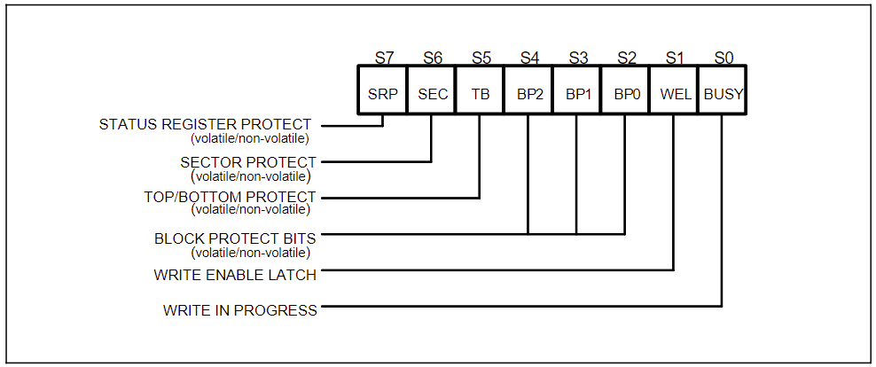
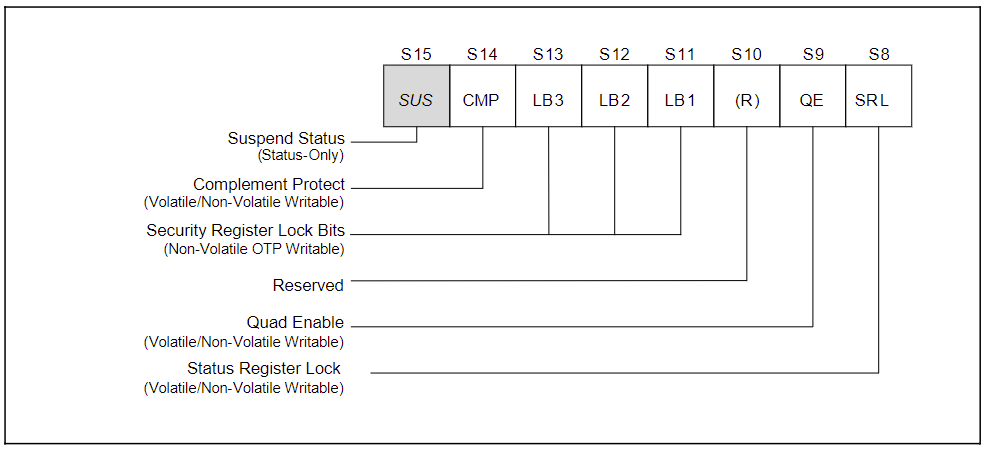
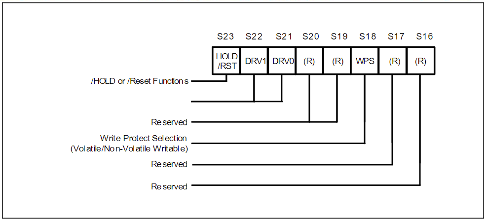
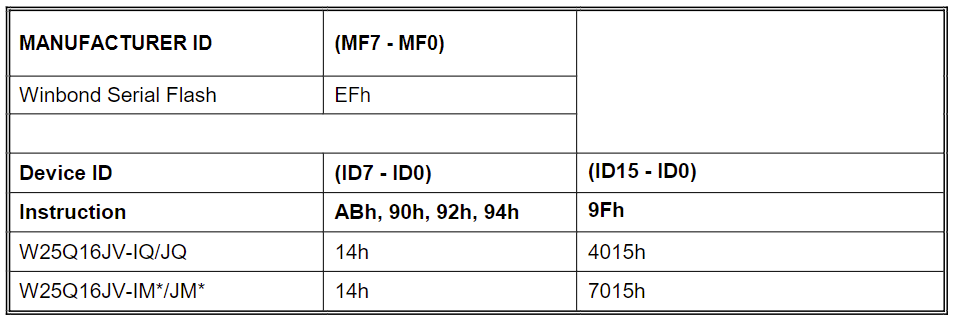
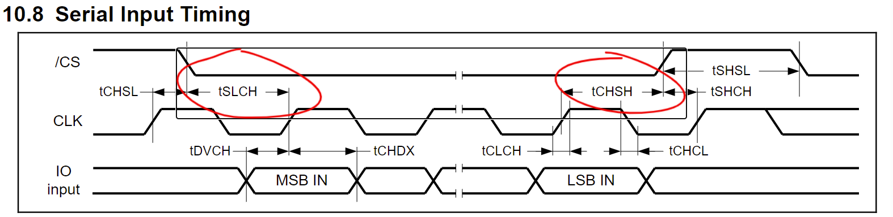
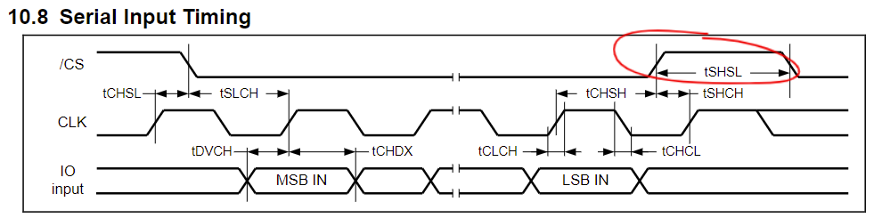
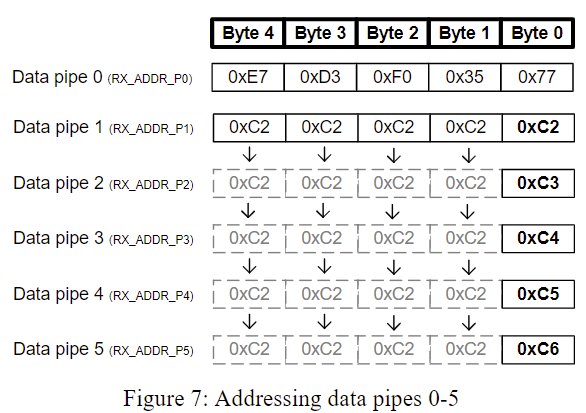

## W25Q16 SPI Flash芯片

### 引脚描述

有以下引脚：

1. 片选信号/CS

   /CS控制使能或不使能。高电平时不使能，设备被取消选中，功率维持在待机水平（除非正在进行内部擦除、编程或写状态寄存器循环）。低电平时设备被选中，功率维持在激活水平，可以写入指令、读出数据。启动后，在一条新的指令被接受之前，/CS必须从高电平过渡到低电平。/CS输入必须在上电和断电时跟踪VCC电源电平，如果有需要，可以在/CS引脚上使用上拉电阻来实现这一点。

2. 串行数据IO

   W25Q16JV 支持标准SPI、双SPI及四SPI操作。标准SPI指令使用单向的DI（输入）引脚在SCLK上升沿串行地向设备写入指令、地址或者数据，使用单向的DO（输出）在SCLK下降沿从设备中读取数据或者状态。

3. 写保护/WP

   /WP用于防止状态寄存器被写入。和状态寄存器的块保护位（ CMP, SEC, TB, BP2, BP1和BP0）以及状态寄存器保护位（SRP）协同使用。小至4KB大小的扇区，大到整个存储器阵列都可以被硬件保护。低电平有效。

4. 保持/HOLD

   /HOLD引脚允许设备在被选中使能时暂停。当/HOLD引脚和/CS引脚都为低电平时，DO引脚为高阻态且DI和SCLK的信号被忽略。/HOLD引脚升高电平之后设备操作将恢复。当多个设备使用同一SPI端口时，需要使用/HOLD功能。

5. 串行时钟SCLK

   提供计时。

6. 复位/RESET

   专用的硬件复位引脚/RESET仅在SOIC-16和TFBGA封装中可用。一旦低电平持续时间超过1us，就会终止任何外部或者内部操作，并且回到上电状态。

### 状态寄存器

共有三个状态寄存器。

#### 状态寄存器1

##### 正在擦除/写入（BUSY）——仅状态

只读，当执行页编程、扇区擦除、块擦除、芯片擦除、写状态寄存器或者擦除或编程安全寄存器指令时设为1。将会忽略除读状态寄存器、擦除或编程挂起指令以外的指令。当擦除、编程或者写状态/安全寄存器完成时BUSY位将会清零。

##### 写使能锁存器（WEL）——仅状态

只读，执行写使能指令之后WEL设为1，写入被禁止时设为0。写入禁止状态在上电时或者以下任意指令之后出现：写入禁止、页编程、四页编程、扇区擦除、块擦除、芯片擦除、写入状态寄存器、擦除安全寄存器和编程安全寄存器。

##### 块保护位（BP2, BP1, BP0）——可写，非易失性

易失性指掉电丢失数据，非易失性指掉电不丢失数据。块保护位是非易失性的，提供写保护控制和状态。块保护位用写状态寄存器指令来设置。所有、没有或者部分的存储阵列可以被保护不被写入或者擦除。出厂默认块保护位都是0，不保护任何存储阵列。

##### 顶部/底部块保护位（TB）——可写

非易失性。控制块保护位从存储阵列的顶部（TB=0）还是底部（TB=1）开始保护。出厂默认为0，根据SRL与WEL位用写状态寄存器指令来设置。具体参见状态寄存器内存保护表。

##### 扇区/块保护位（SEC）——可写

非易失性。控制块保护位按照4KB大小的扇区（SEC=1）还是64KB的块（SEC=0）保护。出厂默认为0。具体参见状态寄存器内存保护表。

##### 状态寄存器保护位（SRP，SRL）——可写

非易失性。SRP是状态寄存器1的最高位，SRL是状态寄存器2的最低位。对状态寄存器的写入控制通过SRL、SRP、写使能指令、/WP引脚共同实现。

| SRL  | SRP  | /WP  | 状态寄存器 | 描述                                                         |
| :--- | :--- | :--- | :--------- | :----------------------------------------------------------- |
| 0    | 0    | X    | 软保护     | /WP没有作用。状态寄存器可以在写使能指令，WEL=1之后写入。出厂默认。 |
| 0    | 1    | 0    | 硬保护     | /WP低电平时状态寄存器被保护，不能写入。                      |
| 0    | 1    | 1    | 硬保护取消 | /WP高电平时状态寄存器解锁，可以在写使能指令，WEL=1之后写入。 |
| 1    | X    | X    | 电源锁定   | 状态寄存器被保护，不能写入，直到下一次掉电—上电之后。        |
| 1    | X    | X    | 一次性编程 | 状态寄存器被永久保护，不能写入。**通过添加前缀命令AAh 55h启用。** |

#### 状态寄存器2

##### 擦除/编程挂起状态位（SUS）——仅状态

只读。执行擦除/编程挂起指令（75H）后设为1。执行擦除/编程恢复指令（7AH）后或者掉电—上电后恢复为0。

##### 补充保护位（CMP）——可写

非易失性。和 SEC, TB, BP2, BP1以及BP0位协同使用，提供更灵活的保护。一旦设为1，前面SEC, TB, BP2, BP1以及BP0位设置保护的阵列区域会反转：原来被保护的现在不再保护，原来不保护的现在会保护。也可以说，CMP=0时SEC, TB, BP2, BP1以及BP0位决定哪些区域被保护，CMP=1时SEC, TB, BP2, BP1以及BP0位决定哪些区域不被保护。出厂默认为0。

##### 安全寄存器锁定位（LB3, LB2, LB1）——非易失性，一次性编程

非易失性，一次性编程（One Time Program，OTP）。提供安全寄存器的写保护控制和状态。出厂默认全为0，表示安全寄存器未锁定。三个位各自可独立地用写状态寄存器指令来设置。OTP表示一旦设置为1，对应的256字节的安全寄存器就永久只读，不可修改。

##### 四SPI使能（QE）——可写

非易失性。为0时/HOLD引脚可用，设备使用SPI或者双SPI协议（后缀IM或者JM的出厂默认模式）；为1时/HOLD引脚不可用，设备使用四SPI协议（后缀IQ或JQ的出厂默认模式），IO2和IO3引脚可用，设备工作在SPI/双SPI/四SPI协议。

#### 状态寄存器3

##### 写保护选择位（WPS）——可写

指定写保护的方案。WPS=0时设备使用 CMP, SEC, TB, BP[2:0]来确定写保护区域，WPS=1时设备使用独立块锁定来保护任意独立的扇区或者块。上电或者复位后所有独立块锁定位默认都是1。

##### 输出驱动强度（DRV1，DRV0）——可写

决定读取操作时的输出驱动强度。

| DRV1，DRV0 | 强度          |
| :---------- | :-------------------- |
| 00         | 100%          |
| 01         | 75%           |
| 10         | 50%           |
| 11         | 25%（默认值） |

### 存储区域划分

整个存储阵列可以以两种方式划分：

1. 分为32个BLOCK块，每个块64KB并且可分为16个SECTOR扇区，每个扇区4KB。
2. 分为8192个页，每页256字节。一次最多编程一页，擦除则可以是一次4KB、32KB、64KB或整个芯片。

### 写保护方案

具体参见数据手册上的状态寄存器内存保护表Status Register Memory Protection table。

### 指令

指令最短1字节，最长7字节。后面可能跟随地址、数据、无用字节或者这些的组合。读指令可以在任意时钟周期之后完成，但写入、编程、擦除指令必须在字节边沿完成传输（输入完整的8个比特），否则指令被忽略。另外正在编程或者擦除时，或者状态寄存器正在被写入时，除了读状态寄存器以外的指令都会被忽略。

指令以/CS的下降沿开始，上升沿结束，所以发送指令必须先把/CS拉低电平，传输完成必须拉高电平。

#### 制造商和设备ID

#### 指令集

具体请看datasheet，这里只介绍常用的。

##### 写使能（06H）

设置WEL位为1，允许写入。在执行以下指令之前必须先设置WEL位：页编程、四页编程、扇区擦除、块擦除、芯片擦除、写入状态寄存器、擦除安全寄存器和编程安全寄存器。指令从/CS拉低电平时开始发送，发送完指令之后必须把/CS拉高电平结束传输。

##### 写使能，对状态寄存器以易失性方式写入（50H）

除了安全寄存器锁定位，三个状态寄存器中所有可写的位都可以以易失性写入。也就是说，写入后，掉电—上电之后又会回到写入前的状态。该指令必须在写状态寄存器指令之前发送，且不会设置WEL位，仅仅用来更改易失性的状态寄存器。

##### 写禁止（04H）

设置WEL位为0。同时页编程、四页编程、扇区擦除、块擦除、芯片擦除、写入状态寄存器、擦除安全寄存器和编程安全寄存器、RESET复位指令、上电之后WEL都自动设置为0。指令从/CS拉低电平时开始发送，发送完指令之后必须把/CS拉高电平结束传输。

##### 读状态寄存器1（05H）、2（35H）、3（15H）

写入读状态寄存器指令后，寄存器值以大端先出的顺序被输出。

可以在任意时刻读状态寄存器，无论当前正在编程、擦除还是写入状态寄存器。这允许BUSY位被检查，以确定当前动作是否完成。状态寄存器可以连续读取。

指令从/CS拉低电平时开始发送，读完数据之后必须把/CS拉高电平结束传输。

##### 写状态寄存器1（01H）、2（31H）、3（11H）

可写的位包括：状态寄存器1中的SEC, TB, BP[2:0] ；状态寄存器2中的CMP, LB[3:1], QE, SRL；状态寄存器3中的DRV1, DRV0, WPS。其他的位只读，不受写入状态寄存器指令的影响。LB[3:1]位是OTP的，一旦写入1，就不能重置为0。

非易失性方式写入前必须发送写使能指令（06H）把WEL设为1允许写入。然后发送写状态寄存器指令（01H/31H/11H），最后写入一个字节。在/CS拉高电平结束传输之后，芯片内部对寄存器的写入将在tw（参见AC电气特性中Write Status Register Time）时间内完成（大概是说，用SPI发送后，要等tw时间才能真正生效？这期间芯片内部把数据真正写入到寄存器）。写入完成后WEL重置0。

易失性方式写入首先发送50H指令，WEL仍为0。掉电后写入的值就会丢失，恢复为非易失性写入的值。SRL、LB位不可从1回到0。发送写入指令后，tSHSL2（参见AC电气特性）时间后寄存器值刷新为写入的值。

指令从/CS拉低电平时开始发送，传输数据结束之后必须把/CS拉高电平结束传输。在tw或者tSHSL2期间内可以发送读状态寄存器指令检查BUSY位，以确定芯片内部的写入是否完成。

##### 读数据（03H）

允许一次读一个或者多个字节。先发送03H，再发送24位的地址（A23~A0）。时钟上升沿接收指令和地址，下降沿输出数据，最高位先出。输出一个字节之后，地址自动加1，并输出下一个字节。因此一条指令就可以读出整个存储器，只要时钟不中断。指令从/CS拉低电平时开始发送，/CS拉高电平时结束读取。

在BUSY=1时读取指令会被忽略。

##### 页编程（02H）

在上次擦除的区域写1~256个字节。必须先发送写使能指令把WEL设置为1。指令从/CS拉低电平时开始发送，然后发送02H与24位的地址，以及至少1个字节的数据。

最多写入256字节。写入时地址自动增加，当写满当前页，也就是地址低8位为FFH的位置，再写入时低8位地址就会回到00H，并且不向高位进位，也就是会回到本页开始处，覆盖本页开始处的数据。所以一般写入的字节数小于当前页剩余字节数，即数据长度<256-地址低8位。例如，当传入地址低8位为0xff，那么就只能再写入1个字节，再写就会回到本页0x00处开始写入。

结束写过程需要把/CS拉高电平。传输结束后tpp时间（参见AC电气特性）后写入才能完成，期间内可以发送读状态寄存器指令检查BUSY位，以确定芯片内部的写入是否完成。

##### 扇区(4KB)擦除（20H）

把指定扇区的所有比特全部设为1。必须先发送写使能指令把WEL设置为1。指令从/CS拉低电平时开始发送，然后发送20H与24位的地址。

发送完指令和地址之后必须把/CS拉高电平结束传输，否则该指令不会运行。传输结束后tSE时间（参见AC电气特性）后擦除才能完成，期间内可以发送读状态寄存器指令检查BUSY位，以确定芯片内部的擦除是否完成。

擦除后WEL归零。若目标页被保护，则擦除不被执行。

##### 32KB块擦除（52H）

把32KB的块的所有比特全部设为1。必须先发送写使能指令把WEL设置为1。指令从/CS拉低电平时开始发送，然后发送52H与24位的地址。

发送完指令和地址之后必须把/CS拉高电平结束传输，否则该指令不会运行。传输结束后tBE1时间（参见AC电气特性）后擦除才能完成，期间内可以发送读状态寄存器指令检查BUSY位，以确定芯片内部的擦除是否完成。

擦除后WEL归零。若目标块被保护，则擦除不被执行。

##### 64KB块擦除（D8H）

把64KB的块的所有比特全部设为1。必须先发送写使能指令把WEL设置为1。指令从/CS拉低电平时开始发送，然后发送D8H与24位的地址。

发送完指令和地址之后必须把/CS拉高电平结束传输，否则该指令不会运行。传输结束后tBE时间（参见AC电气特性）后擦除才能完成，期间内可以发送读状态寄存器指令检查BUSY位，以确定芯片内部的擦除是否完成。

擦除后WEL归零。若目标块被保护，则擦除不被执行。

##### 整片擦除（C7H/60H）

把存储阵列所有比特都设置为1。必须先发送写使能指令把WEL设置为1。指令从/CS拉低电平时开始发送，然后发送C7H或者60H。

发送完指令之后必须把/CS拉高电平结束传输，否则该指令不会运行。传输结束后tCE时间（参见AC电气特性）后擦除才能完成，期间内可以发送读状态寄存器指令检查BUSY位，以确定芯片内部的擦除是否完成。

擦除后WEL归零。若存储阵列中任意区域被保护，则擦除不被执行。

##### 擦除/编程挂起（75H）

中断擦除或者编程操作，转而对其他区域进行读取、擦除或编程。

擦除挂起时不允许任何写状态寄存器（01H）或者擦除操作（0h, 52h, D8h, C7h, 60h, 44h）。擦除挂起仅在擦除扇区或者块时可用，整片擦除时忽略该指令。编程挂起时不允许任何写状态寄存器（01H）或者编程操作（02h, 32h, 42h）。编程挂起仅在页编程或者四页编程时可用。

擦除/编程挂起（75H）仅在SUS=0（当前没有其他挂起）且BUSY=1（正在擦除扇区或块，或正在页编程）时有效，否则忽略指令。挂起最多需要tSUS时间（参见AC电气特性）。之前恢复的擦除/编程操作，现在又要挂起，要求在恢复指令7AH之后的75H与恢复指令间隔不小于tSUS。

挂起期间意外掉电将会重置设备，释放挂起状态。SUS位被置零，目标区域的数据会被损坏。

##### 擦除/编程恢复（7AH）

恢复挂起的擦除/编程操作。仅在SUS=1（当前有挂起）且BUSY=0（没有正在进行的任务）时有效，否则忽略指令。发送指令后SUS立即置0，BUSY在200ns之内置1，同时恢复挂起的操作。

若之前的挂起被意外掉电中断，恢复指令将被忽略。

### 其他AC电气特性

除了上面提到的一些AC电气特性，还有几个需要注意：

#### /CS有效时长

/CS拉低或者拉高维持一定时长后才起效，即表格中/CS Active Setup Time relative to CLK和/CS Active Hold Time relative to CLK。也就是说，指令开始时，要把/CS拉低并等待至少tSLCH时间后才能开始传输，数据传输结束后至少要等tCHSH时间才能拉高/CS。这两个时间分别表示激活时需要多久才能真正激活，以及反激活前需要等待保持多久才能安全反激活。

| 名称                                      | 符号  | 含义                                                  |
| ----------------------------------------- | ----- | ----------------------------------------------------- |
| /CS Active Setup Time relative to CLK     | tSLCH | /CS拉低电平后维持多久芯片才真正激活，可以开始写数据   |
| /CS Not Active Hold Time relative to CLK  | tCHSL | /CS拉低电平前维持多久高电平芯片才真正停止活动         |
| /CS Active Hold Time relative to CLK      | tCHSH | /CS拉高电平前维持多久低电平芯片才完成已有任务可以停止 |
| /CS Not Active Setup Time relative to CLK | tSHCH | /CS拉高电平后维持多久芯片才真正停止                   |

查表得知这4个时间长度都一样，所以不用严格区分它们之间的区别。

另外就是两个指令操作之间/CS需要保持的高电平时间。文档电气特性这一章最后的时序图中给出的是tSHSL，并且查表得知读取和写入是两个不同的值（tSHSL1，tSHSL2）。

### 芯片型号判断

根据手册上的Manufacturer and Device Identification判断。一般软件上只需要读取ID7~ID0，由此判断芯片容量。下面给出对照表。

| 容量    | ID7~ID0 |
| ------- | ------- |
| W25Q80  | 13H     |
| W25Q16  | 14H     |
| W25Q32  | 15H     |
| W25Q64  | 16H     |
| W25Q128 | 17H     |
| W25Q256 | 18H     |

## nrf24l01 2.4G 无线通信模块

模块说明书使用了一个名词”有效载荷（Payload）“来指代承担发射与接收任务的一系列硬件资源。

### Enhanced ShockBurst™发射有效载荷

1. 配置CONFIG寄存器的PRIM_RX位为0。
2. 当需要发送数据时，向TX_ADDR写入接收方地址，向TX_PLD写入要发送的数据。TX-payload的宽度由写入的数据长度决定。必须在CS'拉低电平时连续写入TX-payload，TX_ADDR若未更改则不必重复写入。如果需要接收接收方返回的确认数据包，则应当把接收数据通道0的地址设置为相同地址。
3. 在CE引脚发送正脉冲，宽度至少10us。
4. 发送数据：
   * 给射频前端供电；
   * 启动内部16MHz时钟；
   * 打包射频数据包；
   * 高速传输数据。
5. 如果配置了自动确认（返回的确认数据包必须从接收通道0进入，且要求自动重传数大于0且ENAA_P0=1），那么设备立即进入接收模式，若在确认时间窗内接收到确认包，那么传输成功。状态寄存器中TX_DS位置1，TX FIFO中的数据被清除。若未接收到确认，开启了自动重传就会重发数据包，重传次数达到ARC_CNT阈值后状态寄存器中MAX_RT位被置1，TX FIFO中的数据不会清除。在TX_DS和MAX_RT都为1时IRQ引脚被拉高电平，要拉低IRQ引脚必须手动写入状态寄存器。

### 数据通道

该模块可实现1toN的通信，其中N最高为6，因此模块有6个接收通道，但只有1个发射通道。接收模式下最多同时接收6个同一频率、不同地址的数据通道。使用**EN_RXADDR**寄存器的低6位配置启用接收数据通道，使用**RX_ADDR_Pn**寄存器决定数据通道n的接收地址（n从0到5）。不同数据通道的接收地址不应该相同。数据通道0可以配置独立的40位（5个字节）的接收地址，而数据通道1\~5的接收地址的高4个字节是共享的，仅最后一个字节独立。反映到硬件实现上，就是RX_ADDR_P0和RX_ADDR_P1都是完整的40位，而RX_ADDR_P2\~5只有8位，2\~5地址的高4字节采用和RX_ADDR_P1高4字节相同的值，即与1共享。使用**EN_AA**寄存器配置6个接收通道的自动确认，使用**RX_PW_Pn**配置数据通道n的通道大小（Payload宽度）。

当数据包被某一个数据通道接收且该数据通道配置了自动确认，那么模块就会产生一个具有相同地址的确认数据包。

以下配置为所有数据通道共享：

* CRC 启用/禁用 (CRC在Enhanced ShockBurstTM模式下总是启用)
* CRC 编码方案（CONFIG寄存器，配置为1字节或2字节）
* RX 地址宽度（SETUP_AW寄存器，配置为3\~5字节）
* 信道频率（RF_CH寄存器）
* 射频数据速率（RF_SETUP寄存器）
* LNA增益（RF_SETUP寄存器）
* 射频输出功率（RF_SETUP寄存器）

